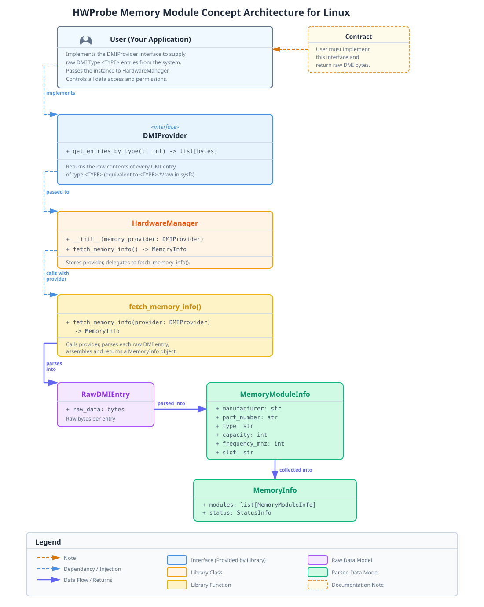

.. _linux-memory-concept:

Memory Concept on Linux
=======================

Overview
--------

For full functionality of the Linux memory module, users are expected to
provide DMI Type 17 data through the ``DMIProvider`` interface.

The library never reads ``/sys/firmware/dmi`` itself. This keeps the library
unprivileged and makes the security boundary explicit.

The user is responsible for deciding whether root privileges are appropriate
for their specific application and for handling any transition to elevated
privileges themselves.

Architecture Diagram
--------------------

Core Principle
--------------

Users implement ``DMIProvider`` to supply raw DMI data however they choose,
for example by reading ``/sys``, loading data from files, using ``dmidecode``,
or using another suitable data source.

The library exclusively consumes the data through the interface and parses it
to assemble a structured representation of the system's memory information.

.. code-block:: python

    def fetch_memory_info(provider: DMIProvider) -> MemoryInfo:
        """
        Parse memory information from user-provided DMI data.

        Args:
            provider: User-implemented data source

        Returns:
            Parsed memory information
        """
        raw_entries = provider.get_entries_by_type(17)

        ...

Why this design:

* Library code never requires root or elevated privileges.
* Users explicitly control when and how data is read.
* The security boundary is clear and auditable.
* Works in restricted environments such as containers and sandboxes.
* Abstracting the interface allows for further expansion of the library to support other hardware information (that may be DMI/SMBIOS related) in the future.

``DMIProvider`` Interface
-------------------------

If the user wants the library to fetch memory information, they must satisfy
the data acquisition contract by implementing the ``DMIProvider`` interface.

This contract is not critical to the operation of other parts of the library
and is therefore optional.

The only consequence of not implementing it is that the library will not be
able to provide memory information on Linux systems.

We strongly encourage users to implement adequate error handling in their
implementation of the interface. Although the library also performs error
handling when calling the interface's method, it is not the library's
responsibility to ensure that the user-provided implementation is correct.

Below is the interface definition and its documentation.

.. code-block:: python

    from abc import ABC, abstractmethod
    from typing import List

    class DMIProvider(ABC):
        """
        Interface for providing DMI data to the library.
        """
        
        @abstractmethod
        def get_entries_by_type(self, t: int) -> List[bytes]:
            """
            Return raw DMI Type <t> entries.
            
            Each entry is the complete binary structure from:
            - /sys/firmware/dmi/entries/<t>-*/raw (requires read access)
            - dmidecode -t <t> --dump-bin output
            - Pre-saved binary files
            - Mock/test data
            
            Returns:
                List of raw DMI Type <t> entries (one bytes object per memory slot)
                
            Raises: ?
            """
            raise NotImplementedError("DMIProvider.get_entries_by_type not implemented")

Usage Example
-------------

Reading from Sysfs
~~~~~~~~~~~~~~~~~~

The following is an example implementation that reads DMI data from
``/sys/firmware/dmi/entries``. Access to the files may require elevated
privileges depending on the system configuration.

.. code-block:: python

    import os
    import subprocess

    from hwprobe.core import HardwareManager
    from hwprobe.core.linux.memory import DMIProvider

    class SysfsProvider(DMIProvider):
        """Read DMI data from /sys/firmware/dmi/entries."""

        def get_entries_by_type(self, t: int) -> list[bytes]:
            entries = []
            dmi_root = "/sys/firmware/dmi/entries"

            if not os.path.isdir(dmi_root):
               raise FileNotFoundError(f"{dmi_root} not found")

            for entry in os.scandir(dmi_root):
                if entry.name.startswith(f"{t}-") and entry.is_dir():
                    raw_path = os.path.join(entry.path, "raw")

                    response = input(
                        "You can feel free to respond with 'N' if you don't wish to proceed with this! Or 'Y' if you do: "
                    )

                    if "n" in response.lower():
                        print("User chose not to proceed with reading DMI data. Returning empty list.")

                        return []

                    value = subprocess.run(
                        ["sudo", "cat", raw_path],
                        capture_output=True,
                        check=True,
                    ).stdout

                    entries.append(value)

            return entries

    provider = SysfsProvider()
    hardware_manager = HardwareManager(provider=provider)

Summary
-------

This architecture enforces a clear contract:

* **User responsibility**: Data acquisition, permissions, and caching.
* **Library responsibility**: Parsing, validation, and error handling.
* **No hidden I/O**: All file and system access is explicit user code.
* **Secure by default**: The library never requires or requests root.
* **Minimal**: One interface, one function, zero unnecessary complexity.

The user implements ``DMIProvider`` however they choose. The library stays
clean, portable, and trustworthy.